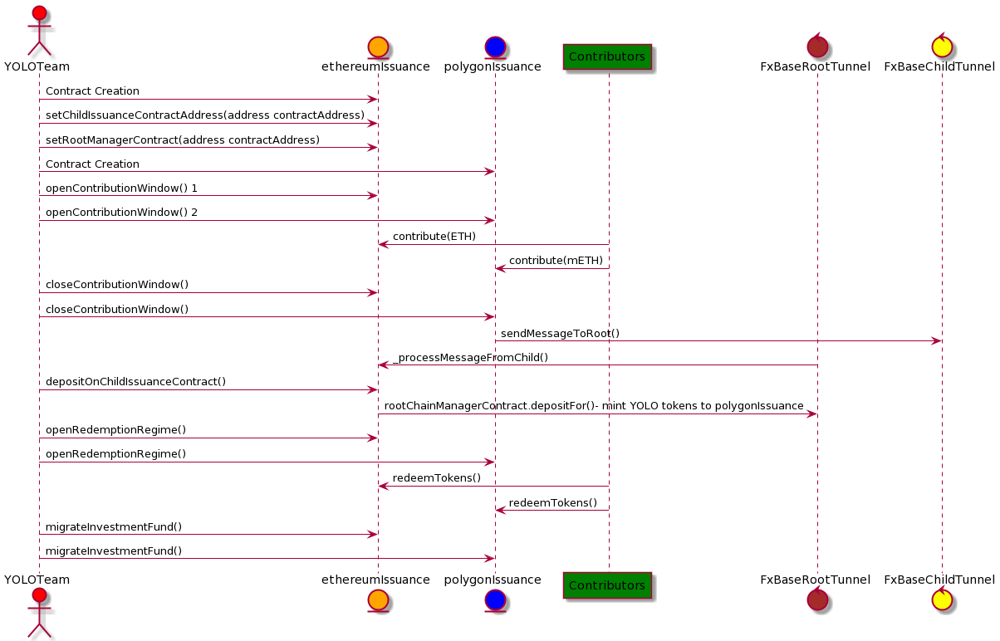

# YOLO token dual-issuance on Ethereum and Polygon

YOLOrekt is deploying a first of its kind synced token dual-issuance both on Ethereum and Polygon. The contributors can choose to buy YOLO tokens on Ethereum with Ether (ETH) or on Polygon with Matic Ether (mETH).

# Testing

Unit tests: Run ganache-cli on the commandline with the necessary flags in order to run tests succesfully: ` ganache-cli -i 1337 -e 10000 -a 20`
Adjust number of accounts as desired.

Coverage: `truffle run coverage --network development`

# Description

Audits have been completed on issuance and token contracts by Dedaub, Nonceblox, and peers. (The remaining contracts are dependencies provided by OpenZeppelin and Polygon, which have been audited.)

- **IssuanceEthereum.sol** (dual-issuance/contracts/issuance/IssuanceEthereum.sol)
- **IssuancePolygon.sol** (dual-issuance/contracts/issuance/IssuancePolygon.sol)

The issuance contracts, simply stated, accept contributions until the end of the token issuance period and then proportionally distribute the combined 5% issuance amount between all the contributors on both chains. Both contracts are highly similar, except for the message passing methods implemented in order to leverage the Polygon POS token bridge and fxTunnel tunnel, which will pass data between root (IssuanceEthereum) and child (IssuancePolygon).

Major contract functions.

1. **openContributionWindow()** - restricted - Opens the issuance contract to contribution from public contributors. Only owners, i.e YOLO team, can open the contribution window on both the contracts i.e IssuanceEthereum and IssauncePolygon.
2. **contribute()** - public - Users can contribute on Ethereum or on Polygon by calling _contribute()_ function directly or by using YOLO's UI. Note: Contributions on Polygon require a 2-step process, where contribution is preceded by a call to approve mEth transfer from the mEth token contract.
3. **closeContributionWindow()** - restricted - Only owners i.e YOLO team can close the contributionWindow on both Ethereum and Polygon.
4. **\_processMessageFromChild()** - Internal function called by FXBaseRootTunnel. (Triggered by _closeContributionWindow()_ on the child chain contract.)
5. **depositOnChildIssuanceContract()** - Only owners i.e YOLO team can call this function after the contribution window is closed and message is processed from child. This function computes the proportion of YOLO token to mint on the Polygon side and then sends a depositFor request which triggers the state sync event caught by Heimdall nodes to mint YOLO tokens on the polygon side.
6. **openRedemptionRegime()** - public - Anyone can open the redemption engine on IssuanceEthereum.sol, but this can be done only after the close of contribution window and processing of data message from the child chain contract. _openRedemptionRegime()_ on IssusancePolygon.sol can only be called after the appropriate portion of tokens are transferred from the root issuance contract (IssuanceEthereum.sol) to the child issuance contract through the POS token bridge.
7. **redeemTokens()** - public - Contributors can redeem tokens only once so its only possible to redeem tokens when the canRedeem flag is set after _openRedemptionRegime_ is called.
8. **migrateInvestmentFunds()\*** - restricted - Only owners i.e YOLO team can call this function after the contribution window has ended.

